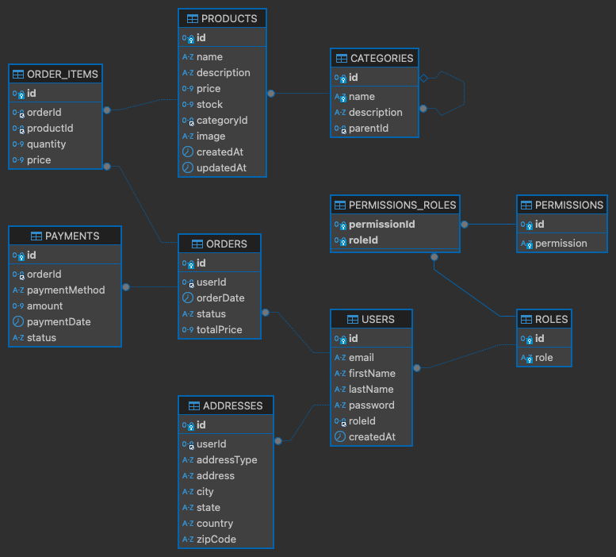
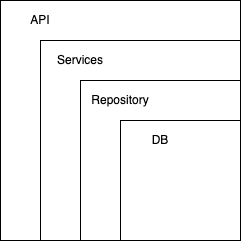

# CRUD-GO
---
This project shows a structured implementation of a Resfull-API using Golang as programming language and the framework Echo.

The goal is to implement a common ecomerce API, which the following databse structure.

# Architecture
The used architecture for the API is an layered architecture based on the MVC architecture, where the API interface to the user, the bussiness logic, the interaction with the database and the connection to the database are divided.

# Endpoints

## User endpoints
- Register a new user: POST localhost:8000/user/register Request Body: {"first_name":"some first name", "last_name":"some last name", "email": "somevalid@email.com", "password":"somepassword"}
- User login: GET localhost:8000/user/login Request Body: {"email": "somevalid@email.com", "password":"somepassword"}
## Address endpoints
- Register a new address: POST localhost:8000/user/address/ Request Body: {"address_type":"billing" || "shipping", "address":"some address", "city":"some city", "state":"some state", "country": "some country", "zip_code":"some zip code"}. Note: This end point works only if an user has loged in.
- Update an address: PATCH localhost:8000/user/address/address_id Request Body: is the same frome the endpoint "register a new address", but only the field, that shall be updated, has to be specified in the request body. Note: This end point works only if an user has loged in.
- Delete an address: DELETE localhost:8000/user/address/address_id Request Body: empty. Note: This end point works only if an user has loged in.
